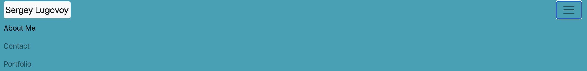
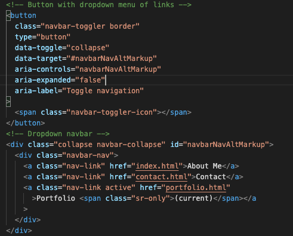
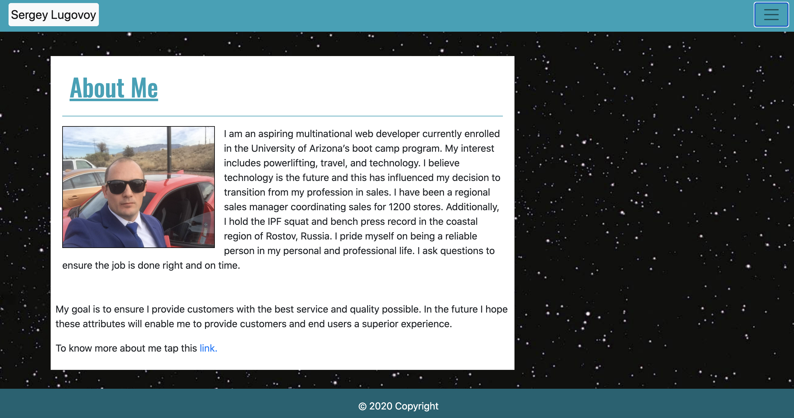
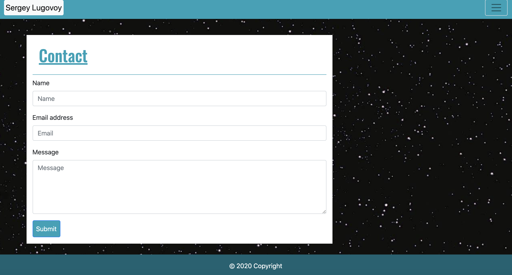
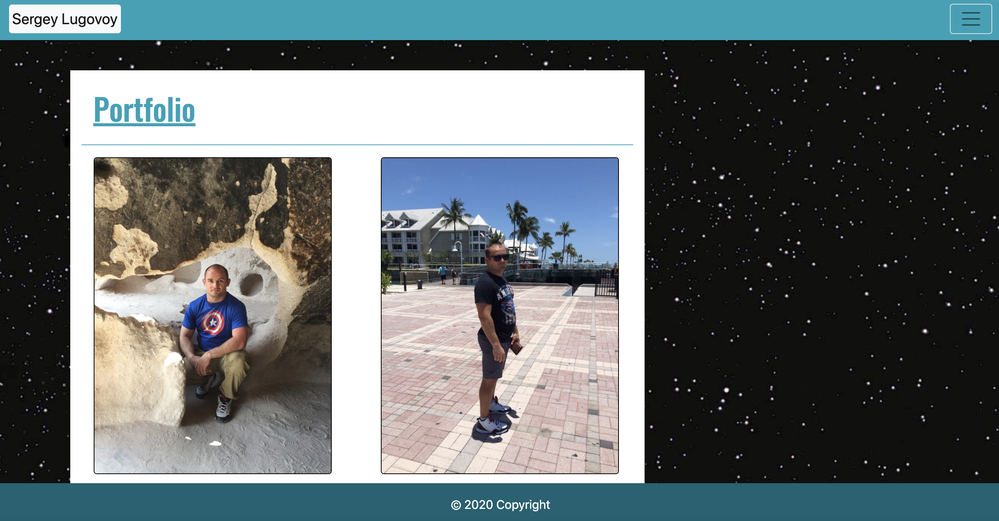

Responsive Portfolio project contains information and pictures that best represent me at this moment. It is simple, meets accessibility standards and mobile/tablets friendly.

You can navigate through using multiple links.

Navbar contains one direct link "Sergey Lugovoy" and button with dropdown menu(appears when you click on it).

Each link will send you to the different page of portfolio

Code for button and dropdown menu

Link "About Me" or "Sergey Lugovoy" will take you to this page

Link "Contact" will take you to this page

Link "Portfolio" will take you to this page

And if you tap this link you can see deployed project.