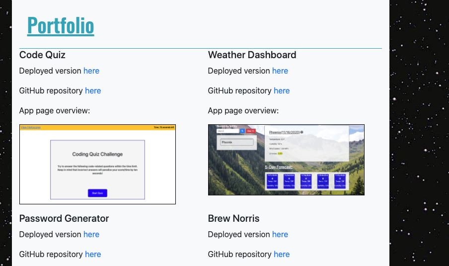

Responsive Portfolio project contains information and pictures that best represent me at this moment. It is simple, meets accessibility standards and mobile/tablets friendly.

If you tap this link  https://slugovoy.github.io/responsive-portfolio/ you can see deployed project.

You can navigate through using multiple links.

Navbar contains one direct link "Sergey Lugovoy" and button with dropdown menu(appears when you click on it).

## Code for button and dropdown menu

Each link will send you to the different page of portfolio

## Link "About Me" or "Sergey Lugovoy" will take you to this page

## Link "Contact" will take you to this page

## Link "Portfolio" will take you to this page

   ## *Technologies, languages, frameworks been used:*

1. HTML - used to create elements on the DOM.
2. CSS - used for styling html elements on page.
3. Bootstrap - used for creating resposive structure and styling for this app.

   ## *License*

The MIT License (MIT)

Copyright (c) 2020 Sergey Lugovoy

Permission is hereby granted, free of charge, to any person obtaining a copy of this software and associated documentation files (the "Software"), to deal in the Software without restriction, including without limitation the rights to use, copy, modify, merge, publish, distribute, sublicense, and/or sell copies of the Software, and to permit persons to whom the Software is furnished to do so, subject to the following conditions:

The above copyright notice and this permission notice shall be included in all copies or substantial portions of the Software.

THE SOFTWARE IS PROVIDED "AS IS", WITHOUT WARRANTY OF ANY KIND, EXPRESS OR IMPLIED, INCLUDING BUT NOT LIMITED TO THE WARRANTIES OF MERCHANTABILITY, FITNESS FOR A PARTICULAR PURPOSE AND NONINFRINGEMENT. IN NO EVENT SHALL THE AUTHORS OR COPYRIGHT HOLDERS BE LIABLE FOR ANY CLAIM, DAMAGES OR OTHER LIABILITY, WHETHER IN AN ACTION OF CONTRACT, TORT OR OTHERWISE, ARISING FROM, OUT OF OR IN CONNECTION WITH THE SOFTWARE OR THE USE OR OTHER DEALINGS IN THE SOFTWARE.

## *My contacts:*
1. Email serg.lugovoy.81@gmail.com
2. Phone - +1(954)303-3692

